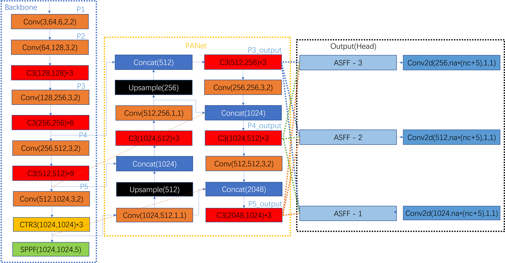

# YOLOv5-based deep Learning in Automated security inspection 
This repo is the implementation of 'YOLOv5-based deep Learning in Automated security inspection'

  

For more information, please see the result.

# Install

[**Python>=3.6.0**](https://www.python.org/) is required with all
[**PyTorch>=1.7**](https://pytorch.org/get-started/locally/):
```bash
$ git clone https://github.com/PT-L97/yolov5-based-Xray-inspection.git
$ cd yolov5-based-Xray-inspection
$ pip install -r requirements.txt
```
In this experiment, I used NVIDIA Geforce RTX 2080ti with Ubuntu 18.04, cuda 11.0, pytorch 1.7.

# Dataset

* `SIXray dataset`
    * `the whole posive samples (8,915 images) and annotations`(trained in this experiments):  [Baidu Drive(pw: ting)](https://pan.baidu.com/s/19wtjZjr4s6T7WLIDwg4agQ) 
    * `The SIXray10, which includes all posive samples with 10x negative samples` (which is not employed in this paper):  [Baidu Drive(pw: gcdw)](https://pan.baidu.com/s/1zqsVnfahGDU7d-suDyiT5Q). 

Here are labels related distribution:
<br/>


# Convert labels
This paper would use VOC XML Annotation Format(yolo labels).

In *`data/` file,
*`voc_lable.py`  transfer SIXRay annotiations to yolo labels.  
You should set the path of SIXray dataset in *`voc_lable.py` first.
```bash
$ python voc_label.py
```

*`split_train_val.py` split the dataset to train, val, test data.
You should set the ratio of split in *`split_train_val.py` first.
```bash
$ python voc_label.py
```

if you don't have annotationas in your own datasets, you could make it yourself by
'''
pip install labelimg
'''
and please put the images and annoations in *`yolov5-based-Xray-inspection/data/mydata1` with the format:
```
mydata1
│   
└───xml
│   │   P00001.xml
│   │   P00002.xml
|   |   ... 
└───images
|   │   P00001.jpg
|   │   P00002.jpg
|   |   ...
└───dataSet
|   │   ...
```
Adding negative samples which are common in reality world is a good choice to make the model robust.

For negative samples, which do not contain any positive samples, try 
```bash
$ python create_xml.py
```
to create negative samples blank *`.xml`.
Then, add the images and xml file to *`images/` and *`xml/` separatively.

# Proposed structure


The model adds MHSA(which is in BotNet) and BiFPN in original backbone, ASFF on original Head. I also tries TTA and CBAM but the mAP decreases with inference time increases. 

For codes, please see [model/read.me](models/readme.md)

All these tricks have been already added to the normal code *`models/common.py` and *`models/yolo.py`

The structure is inspired by feature visualization.

Take all tricks used model(adding MHSA, BiFPN, ASFF) for example:

After training

```bash
$ python train.py --weights yolov5.pt --data data/mydata1/mydata.yaml --hyp data/hyps/hypr.yaml
--cfg models/yolov5l_all.yaml --image-weights
```
Running

```bash
$ python detect.py --weights runs/train/exp70/weights/best.pt --source data/mydata1/detect_img --visualize
```
For the *`P00001.jpg`, 
<br/>


Here is the feature map visualization after the first convolutional operation:
<br/>


By adding these tricks, we could finally extract specific features from each channel like:


For more feature visualization, please see *`runs/detect`.

# Inference

* `Weights` (for *`all` models)
    * `best.pt`:  [Baidu Drive(pw: esg4)](https://pan.baidu.com/s/1SOEYkhwjoJtrg7jpSZ3tnw).
    * `last.pt`:  [Baidu Drive(pw: vdf9)](https://pan.baidu.com/s/1C1Kdxj4yvs3vW-qdm75TJg). 

```bash
$ python val.py --weights runs/train/exp70/weights/best.pt --data data/mydata1/mydata.yaml
--save-txt  --save-conf
```

Here is the result example of this model:
<br/>


# Ensemble(not used in this experiment)

For different models, do weighted boxes fusion by using *`wbf.py`.  
You should set img path and txt path in *`wbf.py`.
```bash
$ python wbf.py
```

# Train

Here is the result of *`train.py`
<br/>


If you have any question, please discuss with me by sending email to *`pl1999@nyu.edu`  

# References
Thanks to their great works
* [ultralytics/yolov5](https://github.com/ultralytics/yolov5)
* [ASFF](https://github.com/GOATmessi7/ASFF)
* [MHSA](https://github.com/positive666/yolov5)
* [BiFPN](https://github.com/zylo117/Yet-Another-EfficientDet-Pytorch)
* [WBF](https://github.com/ZFTurbo/Weighted-Boxes-Fusion)

